# [Upload Tool] 前端

## 简介

该仓库为 Upload Tool 配套的 Web 工程，并且考虑到从事嵌入式开发的朋友大多对于前端技术不是很熟悉，因此在网页源码中没有使用任何框架，完全使用原生 html+js+css 实现【除了打包工具，该工具只是为了将多个文件合并成一个文件】，便于理解和修改。

`c_file` 目录下的 `upload_page.c` 为当前最新的源码生成的数组，可以直接将其加到嵌入式项目中使用。

- PC浏览器效果

<center>

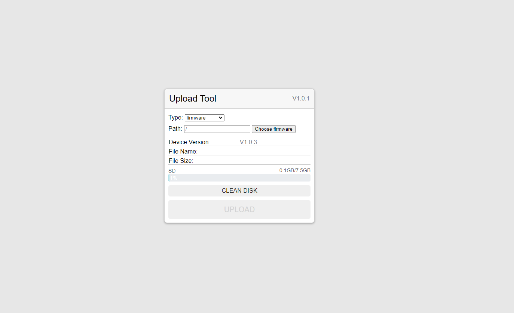
</center>

- 移动端适配
  
<center>

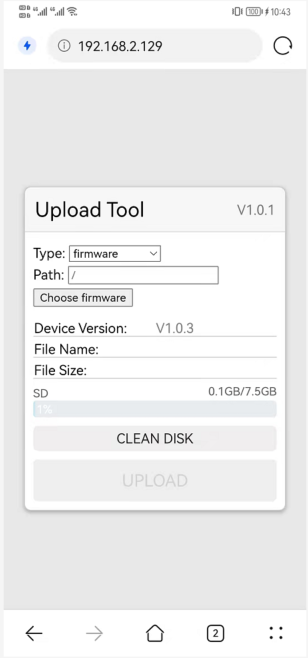
</center>

## 支持功能

该例程目前支持以下功能：

1. 版本号显示
2. 固件上传
3. 文件上传
4. 文件夹上传
5. 存储器清空
6. 存储器容量显示
7. 文件校验

## 操作说明
### 版本号显示
前端通过 `handshake` 交互得到后端返回的版本号，并且会将版本号信息显示在面板的 **Device Version** 一栏。
<center>

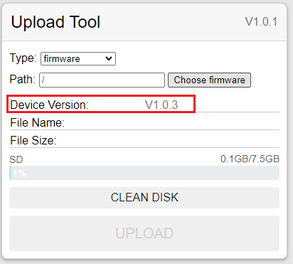
</center>

### 固件上传
使用固件上传功能时面板上的 `Type` 选择 `firmware`，`Path` 保持默认，点击 `choose firmware` 选择 后端支持的升级固件，选择成功后面板会显示固件名和固件大小，并且将原本禁用的`UPLOAD`按钮启用。
<center>

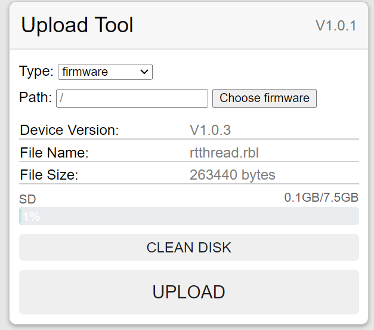
</center>

点击`UPLOAD`按钮开始上传固件，按钮会以进度条的样式显示上传进度，等待上传成功后按钮变为绿色并且浏览器会提示`firmware uploading success`，此时标志固件上传成功，同时后端应开始进行固件升级操作。
<center>

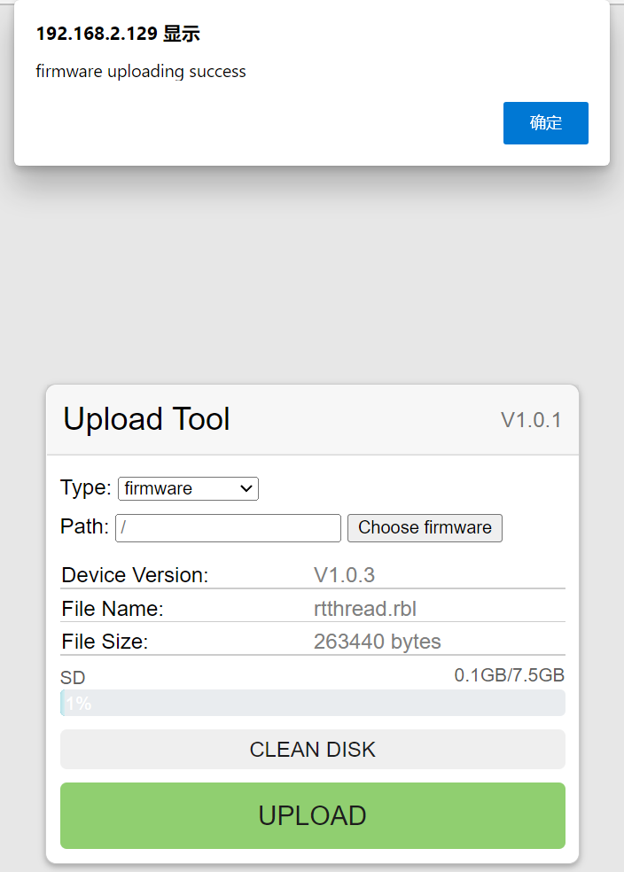
</center>

### 文件上传
使用文件上传功能时面板上的`Type` 选择 `file`，点击 `choose file` 选择待上传的文件，同时可以在`Path`输入框中输入想要上传到的根目录，若不修改则默认根目录为 **/** 目录，假设输入`/data`则会将文件传输到`/data/`目录下。
文件选择成功后同样在面板会显示文件的基本信息，同时会在基本信息下多一个文件描述列表，在这个列表中会显示即将上传到后端的文件的绝对路径。
上传操作与固件上传相同，点击`UPLOAD`按钮后开始上传，等待上传成功后会有对应的提示。若开启了文件校验功能，则在上传成功后还会对上传的文件进行校验，并将结果显示在文件描述列表的文件绝对路径后面。
<center>

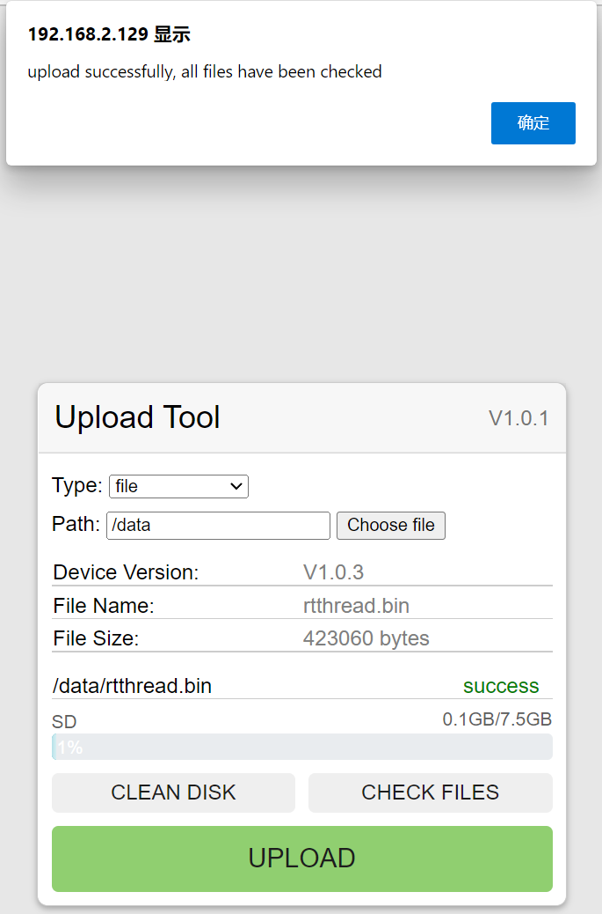
</center>


### 文件夹上传
使用文件夹上传功能时面板上的`Type`选择`directory`,面板中的`File Name`和`File Size`会变为`File Count`和`Directory Size`,分别表示文件夹中包含的文件数量以及总大小。其他操作与文件上传相同。点击`Choose directory`按钮后选择待上传的文件夹，在文件描述列表中会列举所有文件夹中所有文件的信息。点击上传即可将文件夹上传到后端。
<center>

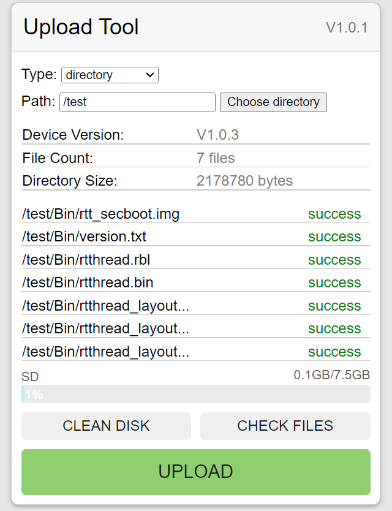
</center>

### 存储器容量显示
若后端支持存储器容量显示则在面板中会显示存储器容量信息，该功能不仅支持单个存储器容量的显示，在后端支持的情况下还可以显示多个存储器容量。
<center>

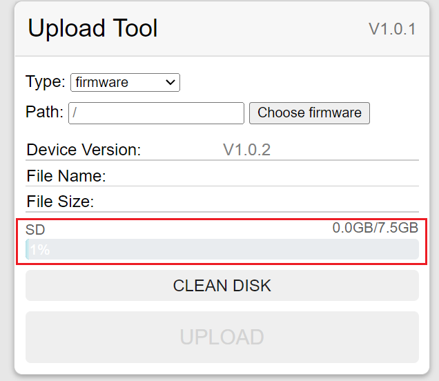
</center>

### 存储器清空
使用存储器清空功能时首先需点击`CLEAN DISK`按钮，此时浏览器会弹出确认提示框，清空存储器会清楚里面所有的数据，所以为了避免误操作，用户还需输入存储器的名字点`确定`才能真正执行清空操作。在此存储器名及面板中存储器容量状态栏中显示的存储器名。
<center>

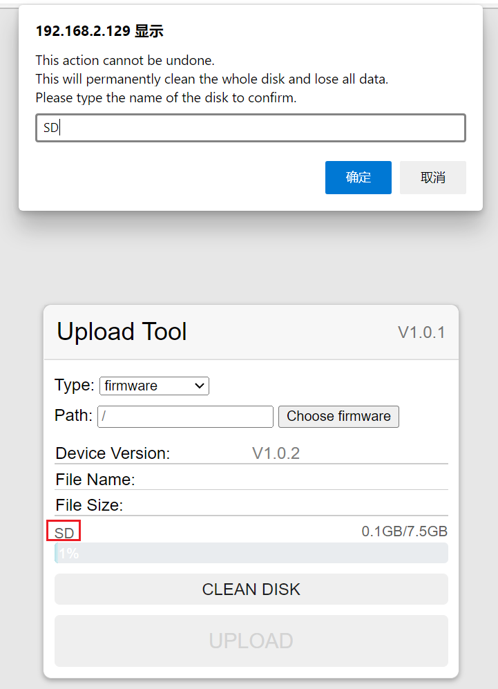
</center>

输入存储器名后点确认并等待一段时间，后端清空结束后浏览器会弹出 `clean [存储器名] success` 的字样，标志着清空的成功。
<center>

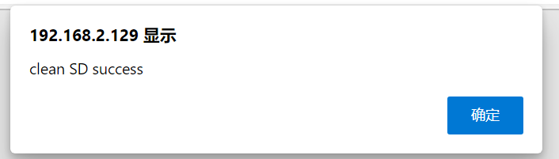
</center>


### 文件校验
在后端支持该功能的情况下，每次文件上传完成都会自动进行一次文件校验，校验成功后文件描述栏会有`success`字样。同时用户也可以自行选择想要校验的文件，通过`Path`输入框将路径调整为后端文件的路径，并点击`CHECK FILES`按钮进行校验，同样校验成功会有`success`字样，若校验失败则会对校验失败的文件显示`error`。校验失败代表着后端对应文件和在浏览器中选择的文件信息不相同，或后端不存在该文件，用户可以根据实际情况进行文件的重传。
<center>

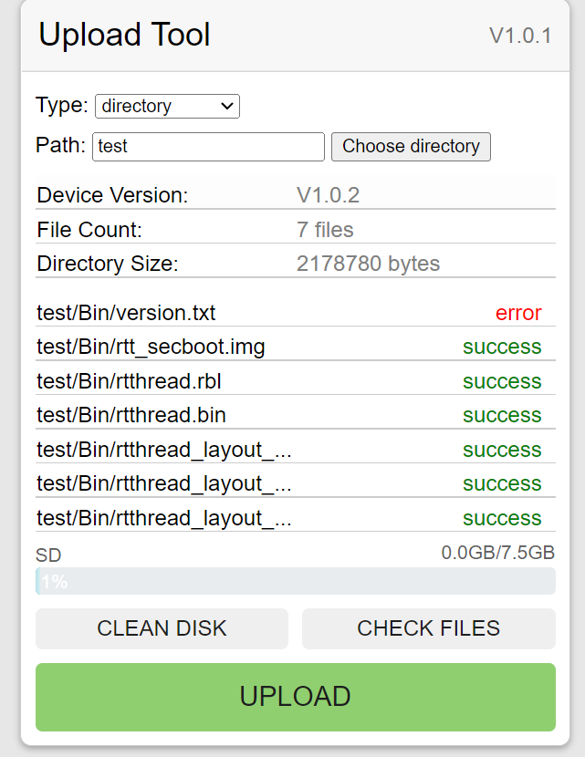
</center>

## 开发
### 目录说明
- c_file
该目录下为作者根据最新发布版编译出的html文件生成的.c源文件。
- config
该目录下为webpack打包工具的配置信息，一般无需修改。
- docs
该目录下为文档相关文件。
- src
该目录下为网页源码，也是开发过程中需要修改的地方。
- 根目录下其他文件
项目根目录下其他文件是对项目打包工具的配置文件和项目依赖描述文件，一般无需修改。
### 工程配置
输入以下命令进行所有依赖包的安装。
```
yarn install
```

### 本地服务器调试
输入以下命令开启本地服务器环境，调试网页源码。
```
yarn serve
```

### 编译工程生成打包文件
输入以下命令对工程进行编译
```
yarn build
```
工程编译完成后会在 dist 目录下生成打包后的`index.html`文件，该文件是整合了css和js并且压缩后的文件，可直接使用。

*注：以上命令都需要在项目根目录下打开控制台输入。需要 nodejs 环境以及 yarn 工具。*

